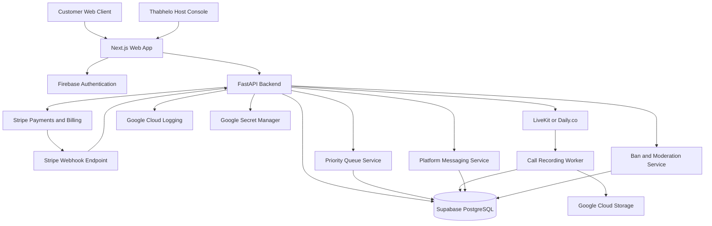
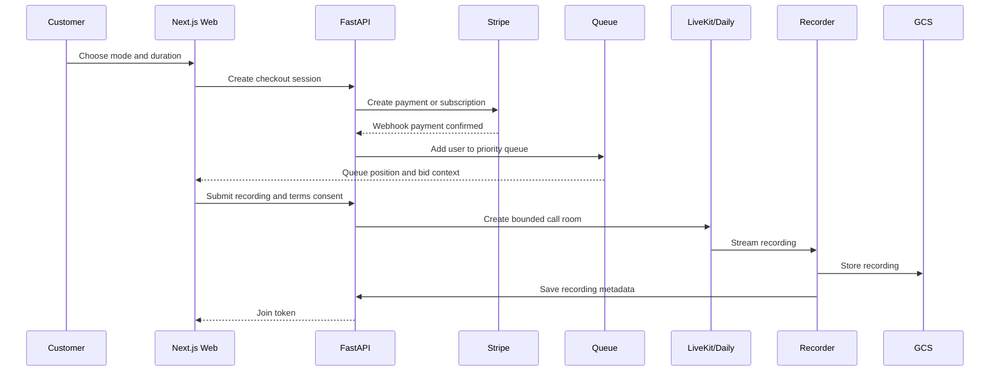
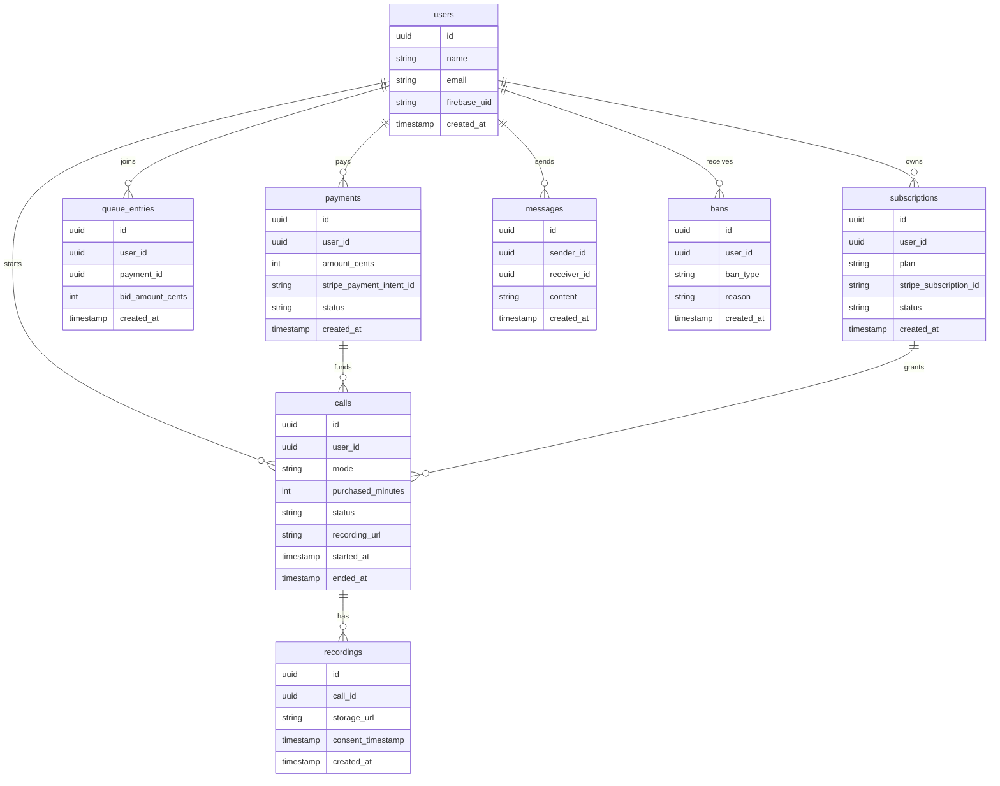

# Ear Low-Level Architecture

## System Diagram



## Request Flow



## Core Services

### Web App

Responsibilities:

- Landing page and product education.
- Authentication UI.
- Mode selection.
- One-off checkout.
- Subscription checkout and account management.
- Priority bid entry.
- Queue status.
- Recording and terms consent.
- Call room UI.
- Text messaging UI.
- Host console.

### API

Responsibilities:

- Verify Firebase identity tokens.
- Create Stripe checkout sessions.
- Receive Stripe webhooks.
- Create subscriptions and payment records.
- Maintain queue entries and priority scores.
- Issue LiveKit or Daily.co room tokens.
- Enforce consent before room entry.
- Store call, message, recording, ban, and subscription state.
- Provide panic-end and user-exit call controls.
- Enforce bans and platform boundaries.

### Queue

Priority score:

```text
priority_score = bid_amount + waiting_time_bonus
```

The initial implementation can compute the waiting bonus at read time from `created_at`.

### Calls

All calls require:

- Authenticated user.
- Paid one-off session or active subscription allowance.
- Recording consent.
- Terms consent.
- No active ban.

All calls support:

- Automatic purchased-time disconnect.
- Host panic end.
- User exit.
- Optional grace extension.

### Recording

Every call is recorded after consent.

Recording metadata stores:

- Recording ID.
- Call ID.
- Storage URL.
- Consent timestamp.
- User ID.
- Payment ID.
- Created timestamp.

## Data Model



## Infrastructure

- Frontend: Next.js.
- Backend: FastAPI.
- Auth: Firebase Authentication.
- Database: Supabase PostgreSQL.
- Payments: Stripe.
- Calls: LiveKit or Daily.co.
- Storage: Google Cloud Storage.
- Hosting: Google Cloud Run.
- Secrets: Google Secret Manager.
- Logging: Google Cloud Logging.
